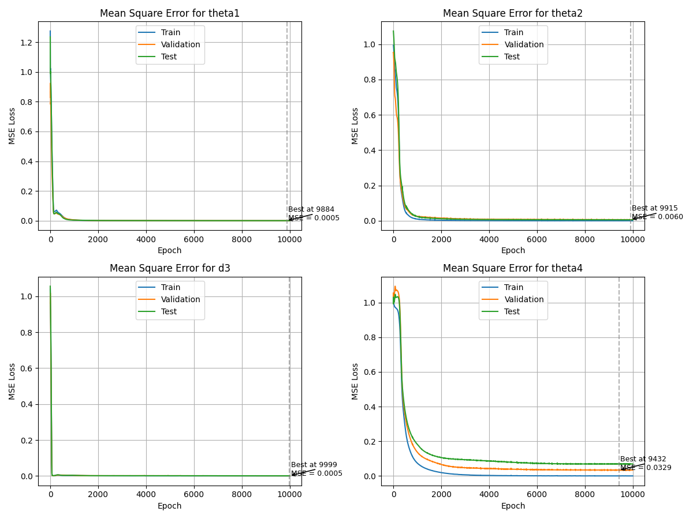
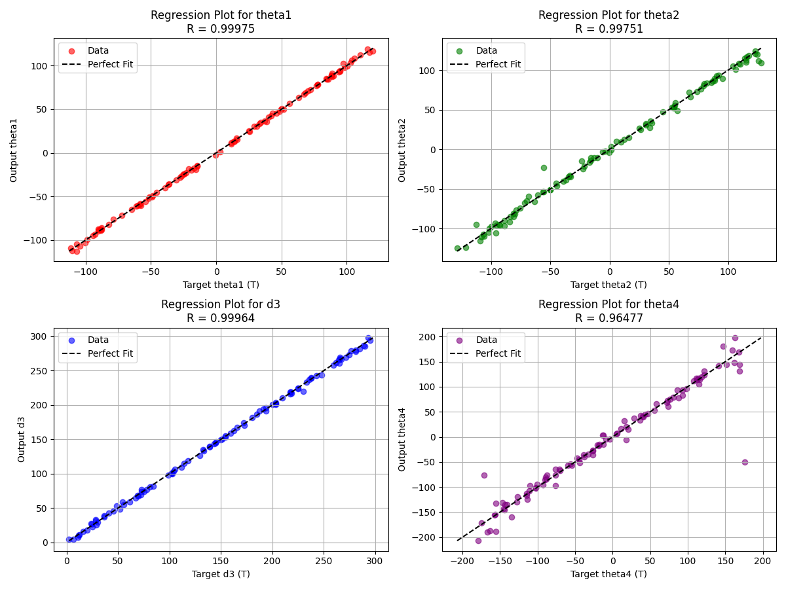

# Inverse Kinematics of a SCARA Manipulator (Paper Replication)

This repository contains my class project, where I **replicate and implement the methods from the paper**:

> Panchanand Jha, B.B. Biswal,  
> *A Neural Network Approach for Inverse Kinematic of a SCARA Manipulator*,  
> International Journal of Robotics and Automation (IJRA), Vol. 3, No. 1, March 2014, pp. 52–61.  
> [Link to Journal](http://iaesjournal.com/online/index.php/IJRA)

---

## 📌 Project Overview
Inverse kinematics is the process of determining joint variables (angles and displacements) required to position the end-effector of a robot at a desired location in Cartesian space. Unlike forward kinematics, the inverse problem generally has **multiple or no closed-form solutions**.

This project implements and tests:
- **Forward kinematics** of a 4-DOF SCARA manipulator using D-H parameters.
- **Inverse kinematics** solutions.
- **Artificial Neural Network (ANN) approach** (Multi-Layer Perceptron with backpropagation) to approximate the inverse kinematics mapping.

---

## 🧑‍💻 Contents
- `inverse_kinematics.ipynb` → Main Jupyter notebook containing:
  - Mathematical derivation of forward/inverse kinematics.
  - Data generation for training neural networks.
  - Implementation of MLP neural network.
  - Simulation results and comparison with analytical solutions.
- `requirements.txt` → Python dependencies.

---

## ⚙️ Requirements
To run the notebook, install the following Python libraries:

```bash
pip install -r requirements.txt
```

---

## 🚀 How to Run
1. Clone this repository:
   ```bash
   git clone https://github.com/USERNAME/inverse-kinematics-paper-replication.git
   cd inverse-kinematics-paper-replication
   ```
2. Install the dependencies (see above).
3. Open the Jupyter notebook:
   ```bash
   jupyter notebook inverse_kinematics.ipynb
   ```

---

## 📊 Results

Here below you can witness the output plots of my code:


*Figure 1: train loss, test loss and validation loss plots*


*Figure 2: Regression plots.*

---

## 📖 Reference
Panchanand Jha, B.B. Biswal (2014).  
*A Neural Network Approach for Inverse Kinematic of a SCARA Manipulator.*  
**International Journal of Robotics and Automation (IJRA)**, 3(1), 52–61.  
ISSN: 2089-4856.

---

## ⚠️ Disclaimer
This repository is for **educational purposes**. It is a class project replicating results from the above paper. All rights to the original research belong to the authors.
